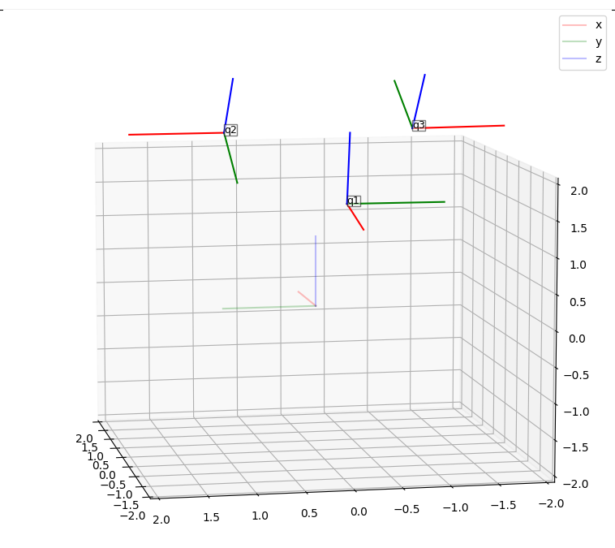
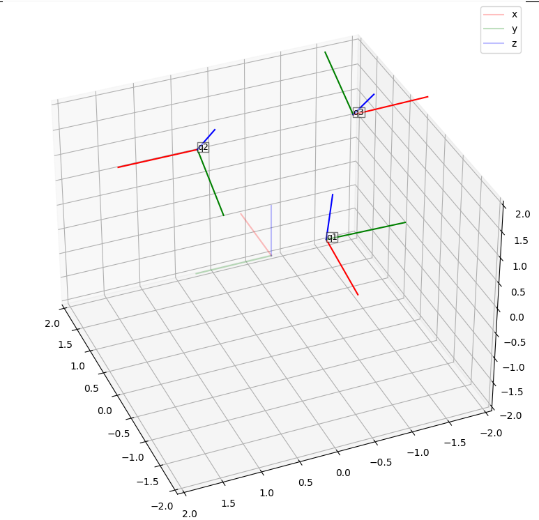

# Transforms
A repository which contains a library for quaternions and rotation matrices. 
Languages it is available in are:
* C++ 
* Python

## Python

[Guide to the python Package](python/README.md)

## Demo

A snippet of the capability of the library to display quaternions

**Views**
Front view             |  Isometric View
:-------------------------:|:-------------------------:
  |  

